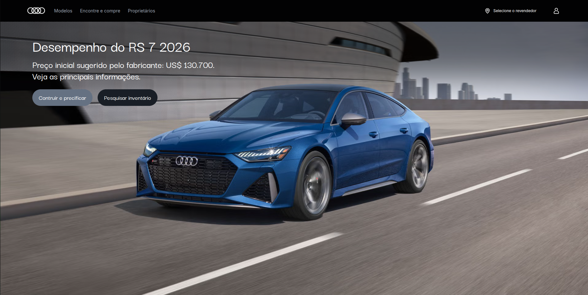

# Audi RS7 Clone

## Sobre o projeto

Este projeto foi desenvolvido com React e Tailwind com o objetivo de aprimorar habilidades.
Ele se trata de um projeto clone do site da audi com design minimalista, responsivo e com menu mobile.

## Funcionalidades

- Interface moderna e responsiva
- Menu mobile funcional
- Troca dinâmica de cores do veículo
- Troca de cor por botões

## Tecnologias utilizadas

- React
- Vite
- TailWind CSS

## Como rodar

git clone https://github.com/renanmiguel2/Audi-rs7
cd Audi-rs7
npm install
npm run dev

## Requisitos

Node.js 17+

## Preview

## Acesse meu projeto

https://cloneaudi.netlify.app/